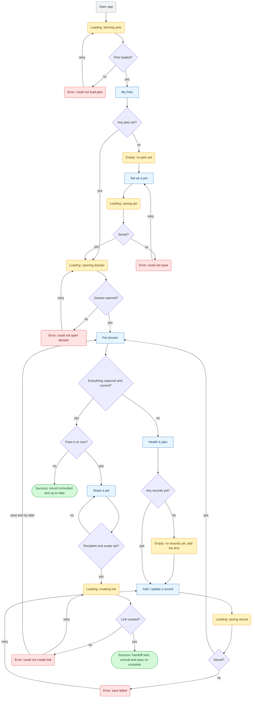
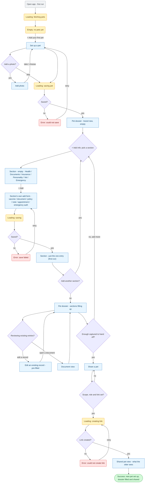
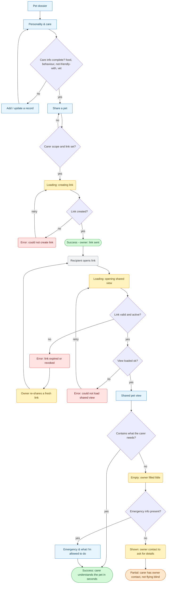
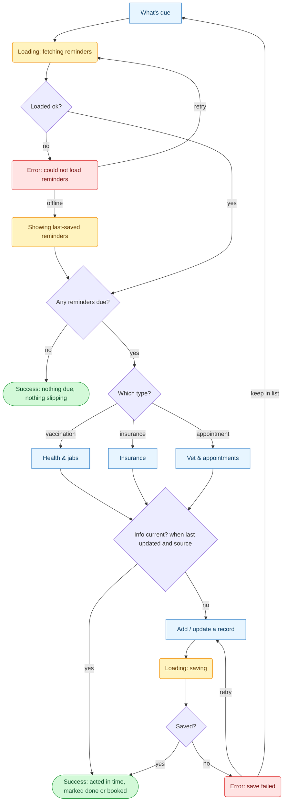
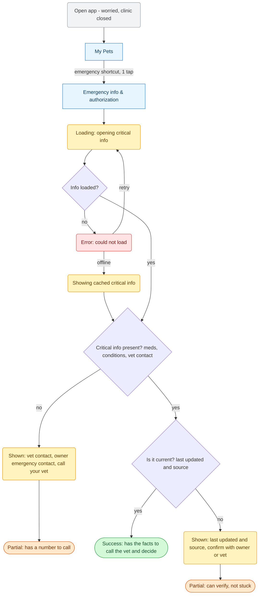

# PetPal — User Flows

Mermaid `flowchart TD`. Every `["screen"]` node exists in [sitemap.md](sitemap.md). One new node — **Add / update a record** — was introduced by these flows and is in the sitemap with its job.

> **Revised after the [critique](sitemap-critique.md):** all 8 terminal dead ends are now **recovery branches** (retry / offline cache / back-to-dossier / re-share / show-owner-contact), and the missing **loading / empty / error** states were added (My Pets fetch, dossier open, brand-new-pet empty sections, share-link create, shared-view load).

**Shape legend**
- `["Screen"]` — a screen (named from sitemap.md)
- `{"Question?"}` — decision point
- `("Loading / Empty / …")` — a **state**, not a screen
- `(["Success / Partial …"])` — an ending

**Colour legend**
- 🟦 **blue** — screen · ⬜ decision (default diamond)
- 🟨 **amber** — loading / empty / recovery state
- 🟥 **red** — error state
- 🟩 **green** — success ending (happy path)
- 🟧 **orange** — *partial* ending: recovered, not stuck (no dead ends remain)

---

## Main job — keep everything in one trusted place: consult & pass on
*Primary persona: Organised Owner.*

---

## New-pet setup — the full onboarding journey *(realized in the interactive prototype)*
*Primary persona: Organised Owner (embodied as **Ana** in the prototype). The **"New pet setup (full journey)"** persona-flow — a first-run owner going from an empty account to a filled dossier that's ready to share.*

> This flow is the concrete, end-to-end onboarding path built in the [wireframes](../wireframes/) (`?flow=setup`). It expands the Main-job "Set up a pet" branch into every section, and introduces four wireframe-realized screens: **Add photo** (`Upload-photo.html`), the **brand-new-pet dossier empty state** with its **"Add info" section-picker** (`home-new.html`), **Edit an existing record** (`Edit-health-record.html` / `Edit-care-note.html`), and **Document view** (`Document-view.html`). No dead ends — every add opens a pre-filled form, every form returns to the dossier.

**What this flow added to the product picture**
- **Add photo** is its own step (take photo / choose from library), reachable from both *Set up a pet* and *Edit pet identity* — no longer an inert avatar.
- The **brand-new dossier** has a dedicated empty state (encouraging copy + a single **"+ Add info"** call-to-action) instead of dropping the owner into a dossier that looks "broken but empty."
- **Uniform, state-truthful sections (all six).** Every section walks the **same three-beat path — empty → its own add form → one-entry** — so the 23-step journey is fully consistent and never shows the fully-populated demo. Each has its own add form (so flow navigation stays unambiguous) and its own `-firstrun` one-entry screen:
  - **Health & jabs** — `-empty` → `Add-record.html` (vaccine) → `Health-and-jabs-firstrun.html` (one vaccine, no conditions card, empty records list).
  - **Documents & passport** — `-empty` → `Add-document.html` → `Documents-and-passport-firstrun.html` (just the EU pet passport).
  - **Insurance** — `-empty` → `Add-insurance.html` → `Insurance-firstrun.html` (one policy, no back-dated start, "No policy document uploaded yet").
  - **Personality & care** — `-empty` → `Add-care-note.html` → `Personality-and-care-firstrun.html` (one note).
  - **Vet & appointments** — `-empty` → `Add-vet-record.html` → `Vet-and-appointments-firstrun.html` (vet clinic + one upcoming appointment).
  - **Emergency info** — `-empty` → `Emergency-auth-setup.html` → `Emergency-info-firstrun.html` (vet + one contact; meds & conditions show "None recorded yet — fills in from Health & jabs").
  - A shared **`Section-saving.html?next=…`** screen animates the save and routes to the right first-run view, keeping every section's add-form file unique (the flow navigates by filename).
- **"What do you want to add?"** is a section-picker modal — each of the six cards opens the matching form with the **section pre-selected** (e.g. Personality → *Behaviour* pre-chosen), so the owner never re-picks what they just chose.
- Every list item (document, jab, health record, appointment, care note, access grant) opens its **own pre-filled Edit/View screen** — "Edit" means edit *that* entry, not a blank Add form.

---

## R2 — make a stranger understand my pet fast
*Owner prepares and shares (Organised Owner) → carer reads it (Receiving Caregiver).*

---

## R1 — stay ahead of what's due
*Primary persona: Organised Owner.*

---

## R5 — make a good call in a worrying moment
*Secondary persona: Worried-at-the-Wrong-Moment Owner. PetPal serves the **information**, not the consultation. Uses the 1-tap emergency shortcut from home.*

---

### Screen nodes used (all in sitemap.md)
My Pets · Set up a pet · Pet dossier · Health & jabs · Personality & care · Insurance · Vet & appointments · Emergency info & authorization · What's due · Share a pet · Shared pet view · Emergency & what I'm allowed to do · **Add / update a record**.
*(Recovery nodes — re-share, show owner contact, offline cache, retry — are **states of existing screens**, not new screens.)*

**New screen nodes introduced by the interactive prototype** (all in [wireframes/](../wireframes/), added to [sitemap.md](sitemap.md) §"Screens realized in the interactive wireframes"):
**Add photo** (`Upload-photo.html`) · **Pet dossier — brand-new empty state / "Add info" hub** (`home-new.html`) · **Per-section add forms** — one per section so flow navigation stays unambiguous: `Add-record.html` (vaccine), `Add-document.html`, `Add-insurance.html`, `Add-vet-record.html`, `Add-care-note.html`, plus `Emergency-auth-setup.html` for emergency · **Section-saving.html** (shared `?next=`-driven "saving…" screen) · **Section first-run states** — the one-entry view of each section after its first addition: `Health-and-jabs-firstrun.html` (one vaccine, no conditions card), `Documents-and-passport-firstrun.html` (one document), `Insurance-firstrun.html` (one policy), `Personality-and-care-firstrun.html` (one note), `Vet-and-appointments-firstrun.html` (vet + one appointment), `Emergency-info-firstrun.html` (vet + contact, meds/conditions pending) · **Edit an existing record** (`Edit-health-record.html`, `Edit-care-note.html`) · **Document view** (`Document-view.html`) · **Pet dossier — single-pet auto-land** (`home-success-single.html`, realizes the single-pet 0-tap rule).
*("Add info" section-picker is a modal on the brand-new dossier, not a separate page.)*
