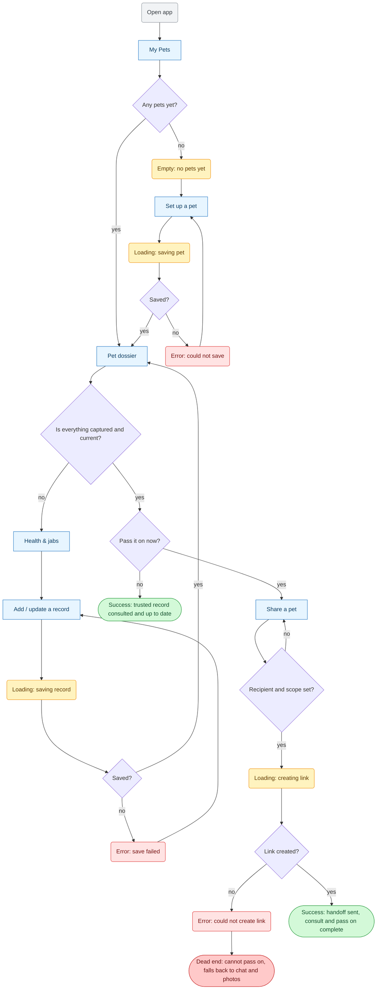
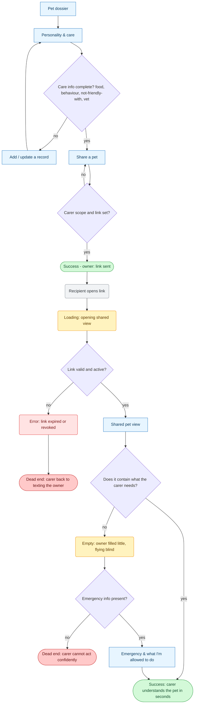
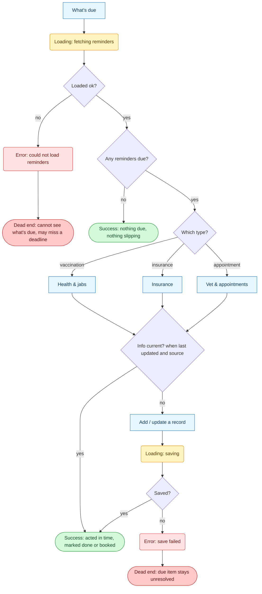
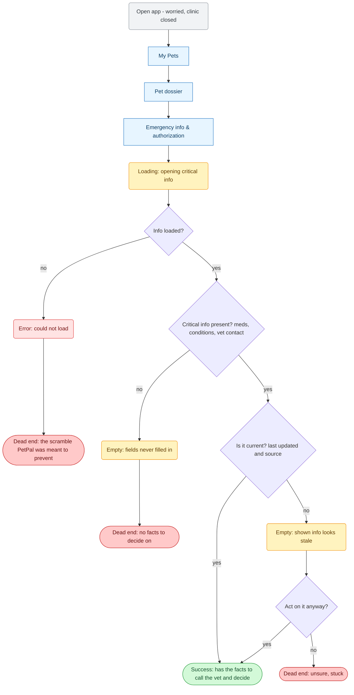

# PetPal — User Flows

Mermaid `flowchart TD`. Every `["screen"]` node exists in [sitemap.md](sitemap.md). One new node — **Add / update a record** — was introduced by these flows and has been added to the sitemap with its job.

**Shape legend**
- `["Screen"]` — a screen (named from sitemap.md)
- `{"Question?"}` — decision point
- `("Loading / Empty / Error …")` — a **state**, not a screen
- `(["Success / Dead end …"])` — an ending (success or stuck)

**Colour legend**
- 🟦 **blue** — screen · ⬜ decision (default diamond)
- 🟨 **amber** — loading / empty state
- 🟥 **red** — error state
- 🟩 **green** — success ending (happy path)
- 🟫 **dark red** — dead end (person gets stuck)

---

## Main job — keep everything in one trusted place: consult & pass on
*Primary persona: Organised Owner.*

---

## R2 — make a stranger understand my pet fast
*Owner prepares and shares (Organised Owner) → carer reads it (Receiving Caregiver).*

---

## R1 — stay ahead of what's due
*Primary persona: Organised Owner.*

---

## R5 — make a good call in a worrying moment
*Secondary persona: Worried-at-the-Wrong-Moment Owner. PetPal serves the **information**, not the consultation.*

---

### Screen nodes used (all in sitemap.md)
My Pets · Set up a pet · Pet dossier · Health & jabs · Personality & care · Insurance · Vet & appointments · Emergency info & authorization · What's due · Share a pet · Shared pet view · Emergency & what I'm allowed to do · **Add / update a record** *(added to sitemap by these flows)*.
