# PetPal — Information Architecture (unified navigation)

One tree for the whole product, consolidating **every page** from [sitemap.md](sitemap.md) and [flows.md](flows.md). Each node carries its job(s) ([jtbd.md](jtbd.md)). Reflects the post-[critique](sitemap-critique.md) structure (Archive/delete merged into *Edit pet identity*, Account-prefs removed, single-pet auto-land + 1-tap emergency).

**Legend**
- 🟪 **entry** — app / journey root · 🟦 **global** — always-visible nav · ⬜ **screen** — standard page
- 🟨 **contextual** — appears inside a flow · ⬜️ **deep** — rare action, a few taps down · 🟩 **recipient** — no-account, link-only
- `· Code` = the job(s) the page serves · dotted edge = shortcut / cross-link
- **Not pages:** loading / empty / error / recovery nodes in [flows.md](flows.md) are *states* of these pages, not separate pages.

---

## Unified IA tree

```mermaid
flowchart TD
  Root(["PetPal"])

  Root --> OwnerApp{{"Owner app · signed in"}}
  Root --> Recipient{{"Recipient · no account, via link"}}

  %% ---- Global nav (owner) ----
  OwnerApp --> Pets["My Pets · Main"]
  OwnerApp --> Whats["What's due · R1"]
  OwnerApp --> Share["Share a pet · S2"]
  OwnerApp --> VetMsg["Vet messages · R3"]

  %% ---- Pets cluster ----
  Pets --> Setup["Set up a pet · Main"]
  Setup --> Photo["Add photo · Main"]
  Pets --> Dossier["Pet dossier · Main"]
  Pets -.->|single-pet auto-land, 0 taps| Dossier
  Pets -.->|first run| NewDoss["New-pet dossier + Add-info hub · Main"]
  NewDoss -.->|section picker| AddRec
  Pets -.->|1-tap emergency shortcut| Emerg["Emergency info & authorization · R5"]

  %% ---- Dossier sections ----
  Dossier --> Health["Health & jabs · R1/R3"]
  Dossier --> Docs["Documents & passport · Main/R3"]
  Dossier --> Ins["Insurance · R1"]
  Dossier --> Pers["Personality & care · R2"]
  Dossier --> VetAppt["Vet & appointments · R1/R5"]
  Dossier --> Emerg
  Dossier --> AddRec["Add / update a record · Main/R1/R3"]
  AddRec --> AddForms["Typed add forms: record · health · document · insurance · vet · care note"]
  AddForms -.->|saving| Saving["Saving… → section first-run"]
  AddRec -.->|edit existing entry| EditRec["Edit a record · Main/R1/R3"]
  Pers -.->|edit existing note| EditNote["Edit care note · R2"]
  Docs --> DocView["Document view · Main/R3"]
  Dossier -.->|new-pet setup| FirstRun["Section first-run states · one-entry per section"]
  Dossier --> EditId["Edit pet identity & lifecycle · Main"]
  EditId -.-> Photo
  Emerg --> EmergSetup["Emergency authorization setup · R5/F6"]

  %% ---- What's due cluster ----
  Whats -.->|tap a reminder| RemDetail["Reminder detail · R1"]
  RemDetail -.->|act on item| AddRec
  Whats --> RemSet["Reminder settings · R1"]
  Whats -.->|offline| RemOffline["What's due · offline · R1"]

  %% ---- Share cluster ----
  Share --> WhoAccess["Who has access · S1"]
  WhoAccess --> EditGrant["Edit / revoke a grant · S1"]
  Share -.->|creates| SharedView

  %% ---- Recipient journey ----
  Recipient --> SharedView["Shared pet view · R2/R3"]
  SharedView --> EmergAllowed["Emergency & what I'm allowed to do · R5/F6"]

  classDef entry fill:#0b3d66,stroke:#9ab2c9,color:#fff;
  classDef global fill:#1971c2,stroke:#a5d8ff,color:#fff;
  classDef screen fill:#e7f5ff,stroke:#1971c2,color:#0b3d66;
  classDef contextual fill:#fff3bf,stroke:#f08c00,color:#663c00;
  classDef deep fill:#ececec,stroke:#868e96,color:#343a40;
  classDef recipient fill:#e6fcf5,stroke:#0ca678,color:#08503b;
  class Root,OwnerApp,Recipient entry;
  class Pets,Whats,Share global;
  class Setup,Dossier,Health,Docs,Ins,Pers,VetAppt,Emerg,VetMsg,Photo,DocView screen;
  class AddRec,RemSet,RemDetail,NewDoss,EditRec,EditNote,AddForms,Saving,FirstRun,RemOffline contextual;
  class EmergSetup,EditGrant,EditId deep;
  class SharedView,EmergAllowed recipient;
```



> **v2 (wireframe-realized) nodes** are folded in above: **Add photo**, **New-pet dossier + Add-info hub**, **Edit a record**, **Edit care note**, **Document view**, the **typed add forms** (record · health · document · insurance · vet · care note) and their shared **Saving…** transient, the per-section **first-run** one-entry states, and for R1 the **Reminder detail**, **Reminder settings**, and **What's due offline** recovery. Dotted edges are shortcuts / cross-links; solid edges are the primary path. **First-run / empty / loading / error / saving are *states* of their parent screen**, shown here because they were built as distinct wireframes — see the [prototype guide](../wireframes/README.md) and [sitemap.md §"Screens realized in the interactive wireframes"](sitemap.md) (codes Sc22–Sc26).

---

## Text outline (same tree)

```
PetPal
│
├─ OWNER APP · signed in
│  ├─ ⌂ My Pets · Main                         (global)   states: success · empty · loading · error
│  │   ├─ Set up a pet · Main
│  │   │   └─ Add photo · Main                  (camera / library; also from Edit pet identity)
│  │   ├─ New-pet dossier + "Add info" hub · Main   (first-run empty state → "What to add?" section picker)
│  │   ├─ Pet dossier · Main   (single-pet auto-land variant → 0 taps)
│  │   │   ├─ Health & jabs · R1/R3          setup states: empty → Add record → first record
│  │   │   │   └─ Edit a record · R1/R3/Main  (edit existing jab / health record, pre-filled + delete)
│  │   │   ├─ Documents & passport · Main/R3  setup states: empty → Add document → first document
│  │   │   │   └─ Document view · Main/R3      (view / download / re-share / replace)
│  │   │   ├─ Insurance · R1                   setup states: empty → Add insurance → first policy
│  │   │   ├─ Personality & care · R2          setup states: empty → Add care note → first note
│  │   │   │   └─ Edit care note · R2          (edit existing note, pre-filled)
│  │   │   ├─ Vet & appointments · R1/R5       setup states: empty → Add vet record → first appointment
│  │   │   ├─ Emergency info & authorization · R5   setup states: empty → Emergency auth setup → newly set up
│  │   │   │   └─ Emergency authorization setup · R5/F6   (deep)
│  │   │   ├─ Add / update a record · Main/R1/R3   — typed forms: Add record (jab) · Add health record · Add document · Add insurance · Add vet record · Add care note
│  │   │   │   └─ Saving… · Section-saving     (shared transient save state → returns to the section's first-run)
│  │   │   └─ Edit pet identity & lifecycle · Main   (deep, incl. archive/delete)
│  │   └─ ⚡ 1-tap shortcut → Emergency info
│  ├─ ⌂ What's due · R1                          (global, all pets · filter: All pets / Miso / Cheetah)
│  │   ├─ Reminder detail · R1                   (tap a reminder → Mark done / Snooze / act; per-reminder via ?rem=)
│  │   │   └─ act on item → Add / update a record
│  │   ├─ Reminder settings · R1                 (push/email, lead time, snooze, quiet hours)
│  │   └─ What's due · offline · R1              (recovery state: last-saved reminders)
│  ├─ ⌂ Me · owner profile                        (global, 4th tab — v3)
│  │   ├─ profile fields · log out → Signed out
│  │   └─ delete profile → Signed out (deleted)
│  ├─ ⌂ Share a pet · S2                         (global)
│  │   └─ Who has access · S1
│  │       └─ Edit / revoke a grant · S1         (deep)
│  └─ Vet messages · R3                          (contextual)
│
└─ RECIPIENT · no account, via link
   └─ Shared pet view · R2/R3
       └─ Emergency & what I'm allowed to do · R5/F6
```

---

## Global navigation & rules (recap from [sitemap.md](sitemap.md))

- **Global nav (3):** **Pets** (Main · consult) · **What's due** (R1 · act in time) · **Share** (S2/S1 · pass on).
- **Single-pet auto-land:** one pet → first screen is its Pet dossier (main job in **0 taps**).
- **1-tap Emergency shortcut:** Emergency info reachable in **1 tap** from home (R5 can't afford 3).
- **No dead ends:** every error/empty state offers a next step (see [flows.md](flows.md)).

## Parked / out of this tree (not silently dropped)
- **R4** (proof okay while away) — ⏸ backlog: no carer→owner update page exists yet.
- **E3** (spare my pet stress) — ⏸ out-of-scope: an offline outcome, no page.
- **Account & notification preferences** — removed; reminder-channel folded into *What's due*.
